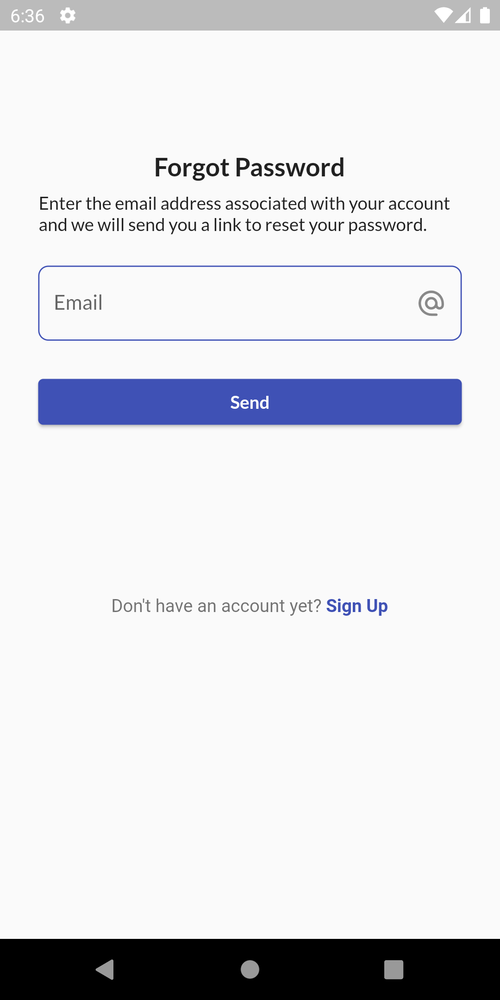

# Flutter Firebase Authentication

<p align="center"></p>

This is a Flutter app that demonstrates how to integrate Firebase Authentication into a Flutter app. With this app, users can register an account, log in, update your profile, and log out. The app uses the Firebase Authentication to handle the authentication process.

## Screenshots

Here are some screenshots of the app:

<div style="display: flex;">
  <div style="text-align: center; margin-right: 10px;">
    
    <p>Splash Screen</p>
  </div>
  <div style="text-align: center; margin-right: 10px;">
    
    <p>Sign In Screen</p>
  </div>
  <div style="text-align: center; margin-right: 10px;">
    
    <p>Sign Up Screen</p>
  </div>
  <div style="text-align: center; margin-right: 10px;">
    
    <p>Forgot Password Screen</p>
  </div>
  <div style="text-align: center;">
    
    <p>Home Screen</p>
  </div>
</div>


## Features

This app includes the following features:

- Registration: Users can create a new account with an email address and password.
- Login: Users can Sign in to their account with their email address and password or can use Google accoun tfor Sign in
- Logout: Users can log out of their account.
- Users can preview their profile and update it.
- Error handling: The app displays error messages when there is a problem with registration or login.

## Technologies

This app was built using the following technologies:

- [Flutter](https://flutter.dev/)
- [Firebase Authentication](https://firebase.google.com/products/auth)

### Project Structure

After successful build, your application structure should look like this:

```
├── android                         - contains files and folders required for running the application on an Android operating system.
├── assets                          - contains all images and fonts of application.
├── ios                             - contains files required by the application to run the dart code on iOS platforms.
├── lib                             - Most important folder in the project, used to write most of the Dart code.
    ├── main.dart                   - starting point of the application
    ├── Screens                     - contains all screens and screen controllers
    ├── utils                       - contains common files and utilities of project
    └── widgets                     - contains all custom widget classes
```

## How to Use

To use this app, follow these steps:

1. Clone the repository to your local machine.
2. Open the project in Android Studio or Visual Studio Code.
3. Set up Firebase Authentication in your Firebase project.
4. Add your Firebase project's google-services.json file to the project.
5. Run the app on an emulator or physical device.

## Sources and credits
Thank you and appreciation to the team behind,

- Flutter
- Firebase

## Contributions

Contributions to this project are welcome. If you find a bug or would like to suggest a new feature, please open an issue on GitHub or submit a pull request.

## License

This app is licensed under the MIT license. See the LICENSE file for more information.